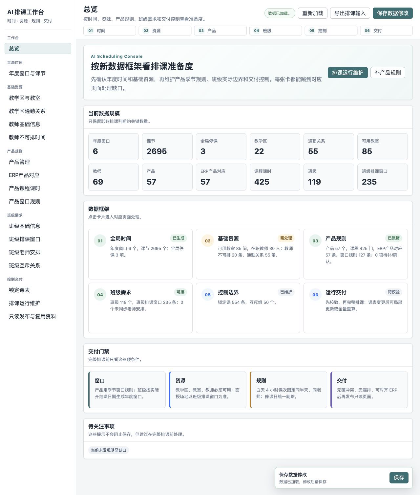
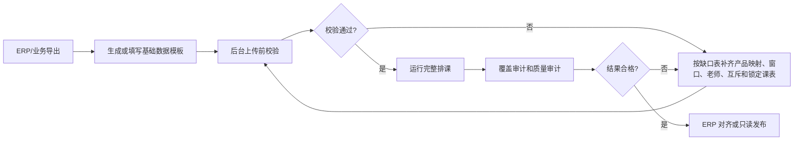
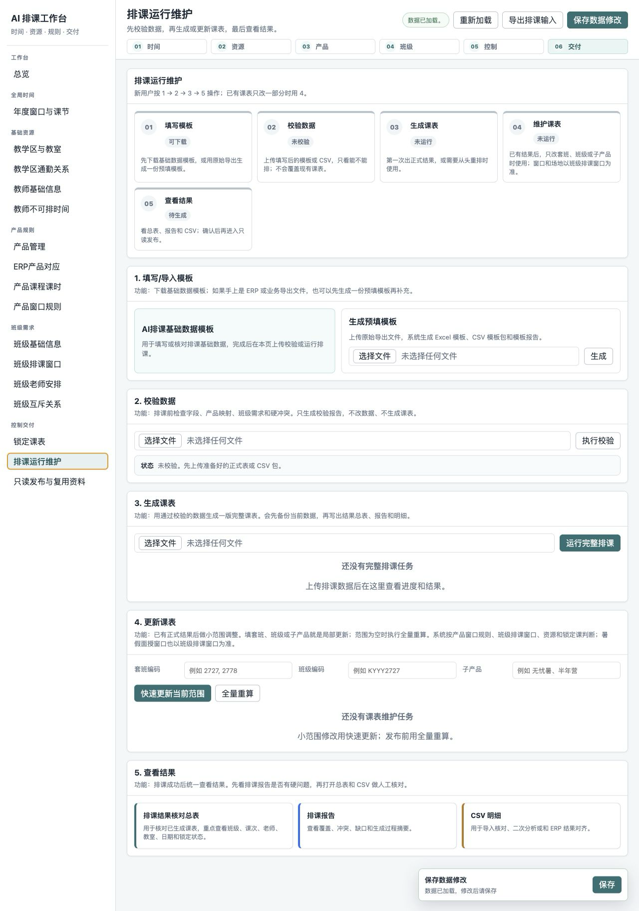

# AI 排课项目部门复用使用攻略

这份攻略给第一次下载本项目的部门同事使用。目标是让大家在本机跑通“数据模板 -> 后台工作台 -> 自动排课 -> 质量验收 -> 只读发布”的完整闭环，而不是先研究全部代码。

系统能重点解决：上课时间安排、课程模块顺序、教室安排、联报班级冲突、老师同日跨教学区通勤质检。老师安排本身仍需要教务和教学提前规划，例如各班各阶段由哪位老师授课、合班时哪个班级承载实际课表、老师月度课量是否合理。

建议把本项目当作“AI 助手 + 标准模板 + 后台工作台 + 排课程序”的组合来用：AI 适合帮助清洗 ERP 导出、整理规则、解释报告和生成补录文件；教务和教学负责确认产品规则、教师安排、合班关系、特殊停课和最终质量验收。

## 1. 本地安装

先安装 Python 3.11 或更高版本，然后在项目目录执行：

```bash
python3 -m pip install -r requirements.txt
bash scripts/verify_release.sh
```

启动后台工作台：

```bash
./scripts/start_admin.sh
```

打开浏览器访问：

```text
http://127.0.0.1:8765
```



如果 8765 端口被占用，可以换端口：

```bash
PORT=8766 ./scripts/start_admin.sh
```

也可以先用公开最小 CSV 示例验证命令行闭环：

```bash
python3 run_scheduling_pipeline.py --source examples/csv_minimal --data-dir /tmp/ai_schedule_demo_data --output-dir /tmp/ai_schedule_demo_outputs --preflight
python3 run_scheduling_pipeline.py --source examples/csv_minimal --data-dir /tmp/ai_schedule_demo_data --output-dir /tmp/ai_schedule_demo_outputs
```

`verify_release.sh` 会自动跑脚本语法检查、全部 Python 脚本编译、CLI 入口 `--help` 冒烟检查、发布包内容审计、单元测试、核心 JSON 样例、公开最小 CSV 示例、覆盖审计和质量审计。公开示例只排一个班级的一次 4 小时课程，用来证明本机环境、模板读取、预检、正式排课、CSV/HTML 输出都正常。

## 2. 工作流总览



日常使用优先进入“排课运行维护”页，按“填写模板 -> 校验数据 -> 生成课表 -> 查看结果”推进。



后台左侧按工作流分组：

| 分组 | 页面 | 用途 |
| --- | --- | --- |
| 全局时间 | 年度窗口与课节 | 维护年度窗口、课节明细、全局停课日期 |
| 基础资源 | 教学区与教室、教学区通勤关系、教师基础信息、教师不可排时间 | 维护可用资源、容量、通勤距离、老师不可排例外 |
| 产品规则 | 产品管理、ERP产品对应、产品课程课时、产品窗口规则 | 维护产品、课程模块、季节窗口规则、ERP 标准产品映射 |
| 班级需求 | 班级基础信息、班级排课窗口、班级老师安排、班级互斥关系 | 维护每个班级实际窗口、场地、老师和联报互斥 |
| 控制交付 | 锁定课表、排课运行维护、发布复用中心 | 固定不可移动课表，执行排课、核对报告并只读分享 |

第一次复用时建议先选 5 到 10 个班级跑小闭环。小闭环能验证本部门的产品命名、ERP 产品对应、老师安排、教室资源和窗口规则是否能跑通，确认没问题后再扩大到完整批次。

## 3. 数据模板怎么填

正式模板以后台当前数据框架为准，共 19 张业务表。每张表第 5 行是中文字段名，第 6 行是程序字段名，数据从第 7 行开始；不要改 sheet 名和第 6 行字段名。

数据来源分三类处理：

- ERP 导出后交给 AI 整理：教学区、教室、教师、班级、ERP 标准产品、历史课表和锁定课表。
- 人工先定口径再填写：年度窗口、全局停课、产品窗口规则、班级窗口边界、教师不可排时间、班级老师安排、互斥组。
- 后台或程序自动生成后人工核对：课节表、班级排课窗口、缺老师补录表、排课结果 CSV、覆盖审计和质量审计报告。

| 顺序 | 表 | 主要来源 | 填写重点 |
| --- | --- | --- | --- |
| 01 | 年度排课窗口表 | 人工维护或后台新增 | 用 `2026暑假`、`2026秋季` 这类“年度+窗口”管理实际排课窗口；默认寒假 1-2 月、春季 3-6 月、暑假 7-8 月、秋季 9-12 月 |
| 02 | 课节表 | 后台按年度窗口批量生成 | 维护日期、星期、上午/下午/晚上、是否可用和不可排原因；批量生成后再补人工停课说明 |
| 03 | 教学区表 | ERP 教学区导出后整理 | 剔除咨询点；住宿、停用、废弃资源保留追溯但不可排 |
| 04 | 教室表 | ERP 教室导出后整理 | 保留教室 ID、所属教学区、容量、教室类型、启用状态 |
| 05 | 教师基础信息表 | ERP 全职教师和班课兼职教师导出 | 维护员工 ID、姓名、主授科目、教师角色、用工类型和在职状态 |
| 06 | 教师不可排日期时段表 | 人工补充 | 只填不可排例外：兼职限制、请假、培训、会议；同一老师可多条 |
| 07 | 产品管理表 | 本地产品口径 | 用本地产品 ID 管理要排课的产品，例如“项目+子产品+课程性质+科目” |
| 08 | 产品课程课时表 | 历史课表、产品方案、人工核对 | 维护阶段、阶段优先级、课程组、模块优先级、课程编码和总课时 |
| 09 | 产品窗口排课规则表 | 人工按产品规则整理 | 按产品+季节窗口维护可排星期、时段、单次课时、每日/每周上限 |
| 10 | 班级基础信息表 | ERP 班级查询导出后整理 | 维护班级、产品、考季、人数、实际开结课日期和默认场地 |
| 11 | 班级排课窗口表 | 由班级日期和产品窗口生成后人工核对 | 逐班逐年度窗口维护最早/最晚可排日期、时段、教学区、教室 |
| 12 | 班级老师安排表 | 教务和教学人工确认 | 按班级、科目、阶段、课程组维护老师；合班时填写实际排课班级 |
| 13 | 班级排课互斥关系表 | 套班编码、联报关系、人工补充 | 维护不能在同一课节上课的班级组 |
| 14 | 锁定课表 | 已排固定课表导出 | 记录不能移动的课，排其他班时要避开这些资源占用 |
| 15 | 教学区通勤关系表 | 地址/经纬度、高德距离、人工判断 | 标记跨区距离和通勤风险，用于质量审计和调整 |
| 16 | 全局停课日期表 | 节假日、中心活动、集中调休 | 所有产品和班级都不能排课的日期，排课时自动避开 |
| 17 | 历史已排课明细表 | ERP 已排课表导出 | 用于抵扣已上课时、学习老师安排和识别合班候选 |
| 18 | ERP产品对应表 | 本地产品和 ERP 标准产品匹配 | 把本地排课产品关联到 ERP 课程编码和版本 |
| 19 | ERP标准产品清单 | ERP 课程产品管理导出 | 作为 ERP 产品对应的只读参考清单 |

最容易卡住排课的表是：`09_产品窗口排课规则表`、`11_班级排课窗口表`、`12_班级老师安排表`、`13_班级排课互斥关系表`、`14_锁定课表`、`18_ERP产品对应表`。

## 4. 三类关键规则

### 产品窗口规则

产品规则只写寒假、春季、暑假、秋季这类季节窗口，不写具体年份。例子：

| 产品窗口 | 填写方式 |
| --- | --- |
| 寒暑营正课英语，寒假 | 周一到周六白天；每次 4 小时、2 节；固定同一半天、同一老师；每日上限 8 小时；每周上下限按业务确认填写 |
| 寒暑营正课英语，春季 | 周二到周六晚上；每次 2 小时、1 节；每日上限 2 小时 |
| 无忧秋，暑假 | 周一到周六白天；每天不超过 4 小时 |

如果白天一次排 4 小时、2 节课，规则里要开启同半天连续块；程序会把两节放在同一上午或同一下午，避免上午一节加下午一节。

### 班级排课窗口

班级窗口按具体年份展开。无忧秋这类跨两个秋季的班级，要分别维护 `2026秋季` 和 `2027秋季`；寒暑营、无忧寒这类寒假和暑假面授可能在不同教学区上课，也在本表按窗口分别维护场地。

班级排课窗口回答四个问题：

- 这个班在这个年度窗口是否纳入本轮排课。
- 最早从哪天、哪个时段开始排。
- 最晚到哪天、哪个时段结束。
- 这个窗口使用哪些教学区和教室，是否必须使用指定教室。

### 老师、互斥和锁定课表

- 老师安排按 `班级 + 科目 + 阶段 + 课程组` 维护，不靠班级名称猜老师。
- 合班共享课表时，一个班级是实际排课班级，其他班共享它对应课次的时间、老师和教室。
- 教师不可排日期时段只记录例外，全职老师默认可排；全职请假也填在这里。
- 互斥组用于联报学生群体，组内班级不能同课节上课。
- 锁定课表用于已经人工排好且不能移动的课，后续自动排课会避开。

## 5. 上传前校验

后台操作：

1. 打开“排课运行维护”。
2. 上传原始导出、填写后的 Excel 模板或 CSV 模板包。
3. 点击“执行校验”。
4. 按报告和缺口文件补齐数据。

命令行操作：

```bash
python3 run_scheduling_pipeline.py --source incoming --preflight
```

校验通过才进入正式排课。校验未通过时不要强行排课，先处理报告里的阻塞项。

| 结果 | 处理方式 |
| --- | --- |
| 缺老师安排 | 下载 `missing_class_teacher_assignments_*.csv`，补齐老师后重新上传 |
| 缺产品映射 | 在 ERP 产品对应页补齐本地产品和 ERP 标准课程产品关系 |
| 无可用课节 | 检查课节表 `is_usable`、全局停课日期、产品窗口规则和班级排课窗口 |
| 教室不可用或容量为 0 | 回到教学区与教室页核对启用状态、容量和班级窗口里的教室选择 |
| 班级窗口缺边界 | 回到班级排课窗口页补齐最早/最晚日期时段和窗口场地 |

## 6. 正式排课

预检通过后，再执行完整排课：

```bash
python3 run_scheduling_pipeline.py --source incoming
```

后台运行时会自动生成：

- `data/scheduler_input_draft.json`：排课器实际输入。
- `outputs/schedule_<timestamp>.csv`：排课明细。
- `outputs/schedule_<timestamp>.html`：可视化课表。
- `outputs/import_report_<timestamp>.md`：导入和排课报告。
- `outputs/backups/`：正式运行前的数据备份。

核心排课器也可以单独验证：

```bash
python3 scheduler.py \
  --input examples/input_example.json \
  --output /tmp/schedule.csv \
  --html-output /tmp/schedule.html
```

## 7. 排课结果质量检查

排课成功不等于可以发布。至少检查这些信号：

| 检查项 | 合格标准 |
| --- | --- |
| 不撞车 | 同一老师、班级、教室、互斥组没有同课节冲突 |
| 不漏课 | 每个进入排课范围的班级需求课时都被覆盖 |
| 日期合理 | 每个班只排在自己的班级排课窗口内 |
| 规则合理 | 产品可排星期、时段、每日上限、同半天连续块规则被执行 |
| 能交付 | CSV 可核对，HTML 可阅读，报告说明清楚 |

可执行的审计命令：

```bash
python3 scripts/audit_schedule_coverage.py \
  --data-dir data \
  --schedule-csv outputs/schedule_<timestamp>.csv \
  --out-dir outputs \
  --timestamp <timestamp>

python3 scripts/audit_schedule_quality.py \
  --data-dir data \
  --schedule-csv outputs/schedule_<timestamp>.csv \
  --out-dir outputs \
  --timestamp <timestamp>
```

覆盖审计用于看课时是否排足；质量审计用于看周课量、同日负载、老师跨教学区移动等体验问题。硬冲突和覆盖缺口必须处理，质量问题按优先级处理或说明原因。

## 8. ERP 对齐和只读发布

ERP 回写前，先确认 `18_ERP产品对应表` 已经把本地产品关联到 ERP 课程编码和版本；否则课程 ID、课程名称和版本无法稳定回写。

如果要回写 ERP，先确认本部门系统使用哪一种导入方式：

1. 如果 ERP 支持按排课结果直接导入，就用 `outputs/schedule_<timestamp>.csv` 对齐课次 ID、日期、时间、班级编码、教师 ID、教室 ID、课程 ID。
2. 如果 ERP 需要先生成空白课次，再按课次 ID 回写，先从“课次梳理/课表导入”页面下载待排课班级的空白课表模板；必要时把空白课表日期整体临时后移，导入系统生成可回写课次；再根据班级编码和课次 ID，把程序排课结果写回导入模板。
3. 回写前核对 `18_ERP产品对应表` 和 `19_ERP标准产品清单`，确保本地产品能稳定对应 ERP 课程编码、版本和课程名称。

只读发布用于给同事查看结果，不开放后台保存、导入和排课接口。

本地生成登录密码哈希：

```bash
python3 schedule_publish_server.py --hash-password
```

本地预览：

```bash
export SCHEDULE_VIEWER_USERNAME="schedule-viewer"
export SCHEDULE_VIEWER_PASSWORD_HASH="上一步生成的哈希"
export SCHEDULE_VIEWER_SECRET_KEY="$(python3 -c 'import secrets; print(secrets.token_urlsafe(48))')"
PORT=8780 ./scripts/start_schedule_publish.sh
```

访问：

```text
http://127.0.0.1:8780/schedule
```

## 9. GitHub 下载复用建议

其他部门 clone 后推荐顺序：

```bash
git clone <仓库地址>
cd <项目目录>
python3 -m pip install -r requirements.txt
bash scripts/verify_release.sh
./scripts/start_admin.sh
```

仓库里包含程序、后台页面、脚本、公开示例、测试和文档；不包含本部门真实 `data/` 数据、`outputs/` 历史输出、`.env`、密码、Cookie、Token、API Key。

使用 AI 助手协作时，可以把仓库链接、这份攻略和本部门导出的 Excel/CSV 一起提供给助手，让它按以下顺序处理：先识别本部门产品和班级口径，再生成或修正模板表，然后执行上传前校验，最后根据报告逐项补齐。不要让 AI 直接猜老师安排、强行放宽硬规则或跳过人工质检。

## 10. 问题排查

| 现象 | 优先检查 |
| --- | --- |
| 端口打不开 | 终端是否还在运行、端口是否被占用、是否改用 `PORT=8766` |
| 上传后没有排课结果 | 是否只做了预检，或预检报告是否有阻塞项 |
| 课表缺很多课 | 产品课程课时、班级适用阶段、历史课表扣减、班级窗口是否正确 |
| 老师冲突多 | 教师不可排时间、合班共享课表、锁定课表是否维护准确 |
| 教室不对 | 班级排课窗口里的教学区/教室是否覆盖了班级默认教室 |
| 报告打开乱码或不可读 | 在后台“发布复用中心”打开报告预览页；原始 Markdown 仍可下载 |

每次修改基础数据后，建议先跑 `--preflight`，再正式排课。
